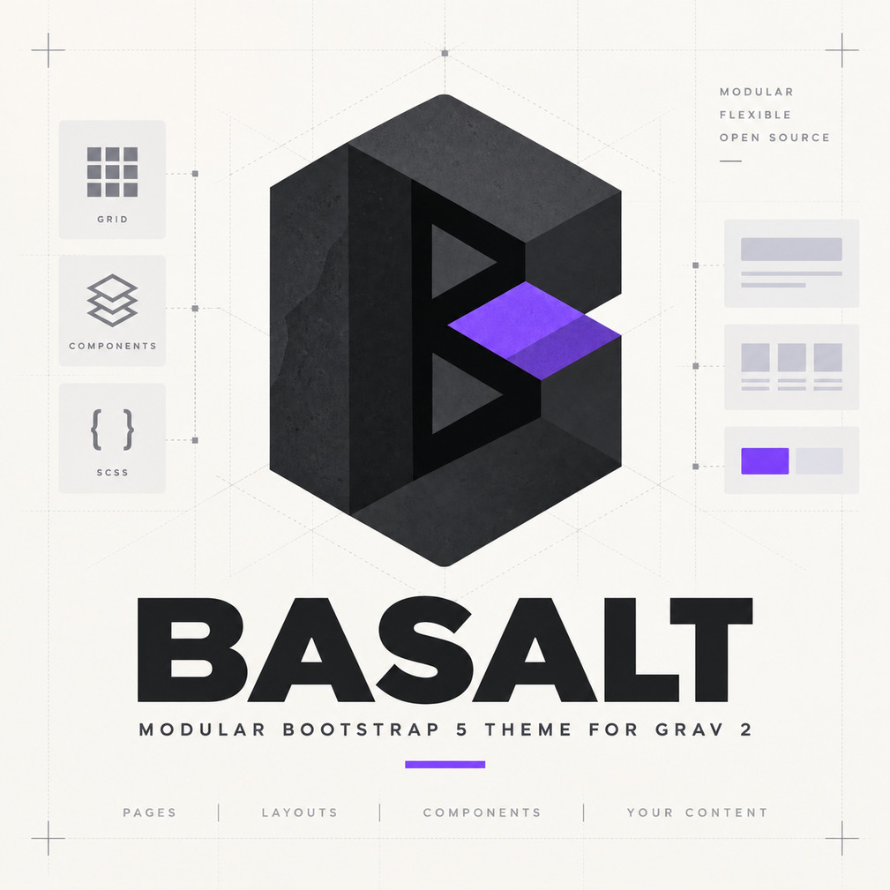

# Basalt



Basalt is a modular Bootstrap 5 base theme for Grav 2. It provides a minimal
foundation for building custom Grav themes without requiring the complete
Bootstrap CSS and JavaScript bundle.

> Basalt is currently in early development. Its structure and public API may
> change before version `1.0.0`.

## Features

- Grav 2 and PHP 8.3+ support
- Bootstrap 5 installed from npm
- selectable Bootstrap SCSS components
- selectable Bootstrap JavaScript components
- custom SCSS architecture
- JavaScript bundling with esbuild
- Gulp development and production tasks
- development source maps
- minified production assets
- Node.js version pinned with `.nvmrc`
- compiled assets included in `dist`
- foundation for inherited Grav themes

## Requirements

Development requires:

- Grav 2.0+
- PHP 8.3+
- Node.js 22
- npm 10+

Node.js `22.23.2` is defined in `.nvmrc`.

The compiled theme can be used without Node.js or npm.

## Installation

Clone the repository into the Grav themes directory:

```bash
cd user/themes
git clone git@github.com:nmorajda/grav-theme-basalt.git basalt
```

Activate the theme in the Grav Admin panel or set it in your Grav configuration:

```yaml
pages:
  theme: basalt
```

## Development

Enter the theme directory and activate the required Node.js version:

```bash
cd user/themes/basalt
nvm install
nvm use
npm ci
```

Start the development watcher:

```bash
npm start
```

Create production assets:

```bash
npm run build
```

Development builds include source maps. Production builds are minified and
written to:

```text
dist/css/style.css
dist/js/script.js
```

## Modular Bootstrap SCSS

Bootstrap components are selected in:

```text
src/scss/_bootstrap-components.scss
```

Only the required imports should remain enabled.

The default configuration includes Bootstrap base styles, containers, grid,
visually hidden helpers and dismissible alert styles without compiling every
Bootstrap component.

Bootstrap variables can be overridden before Bootstrap components are loaded.
Place Basalt and Bootstrap overrides in:

```text
src/scss/settings/_variables.scss
```

Custom theme styles are organized under:

```text
src/scss/base/
src/scss/components/
src/scss/layout/
src/scss/settings/
src/scss/tools/
src/scss/utilities/
```

## Modular Bootstrap JavaScript

The main JavaScript entry file is:

```text
src/js/script.js
```

Bootstrap JavaScript components are selected in:

```text
src/js/modules/bootstrap.js
```

Only the required component imports should remain enabled:

```js
import "bootstrap/js/dist/alert";

// import "bootstrap/js/dist/collapse";
// import "bootstrap/js/dist/dropdown";
// import "bootstrap/js/dist/modal";
```

When enabling a JavaScript component, make sure its corresponding SCSS imports
are also enabled in `src/scss/_bootstrap-components.scss`.

For example, dismissible alerts require:

```scss
@import "bootstrap/scss/transitions";
@import "bootstrap/scss/alert";
@import "bootstrap/scss/close";
```

and:

```js
import "bootstrap/js/dist/alert";
```

Dropdowns, popovers and tooltips additionally require Popper.

The selected Bootstrap modules and custom JavaScript are bundled by esbuild
into a single `dist/js/script.js` file.

See the
[Bootstrap optimization guide](https://getbootstrap.com/docs/5.3/customize/optimize/)
for more information about selective JavaScript imports.

## Theme inheritance

Basalt is intended to serve as a reusable parent theme. Project-specific Grav
themes can inherit its templates and assets while providing their own Twig
templates, SCSS variables, components and branding.

This keeps the Bootstrap foundation and build environment reusable across
multiple projects.

## Project structure

```text
basalt/
├── dist/
│   ├── css/
│   │   └── style.css
│   └── js/
│       └── script.js
├── images/
│   └── logo.png
├── src/
│   ├── js/
│   │   ├── modules/
│   │   │   └── bootstrap.js
│   │   └── script.js
│   └── scss/
│       ├── base/
│       ├── components/
│       ├── layout/
│       ├── settings/
│       ├── tools/
│       ├── utilities/
│       ├── _basalt.scss
│       ├── _bootstrap-components.scss
│       └── style.scss
├── templates/
│   └── partials/
├── basalt.php
├── basalt.yaml
├── blueprints.yaml
├── gulpfile.js
├── package.json
└── README.md
```

## Production assets

The `dist` directory is committed to the repository intentionally. This allows
the theme to be installed and used without running the Node.js build process.

Source maps are development-only and are excluded from Git.

## License

Basalt is released under the [MIT License](LICENSE).