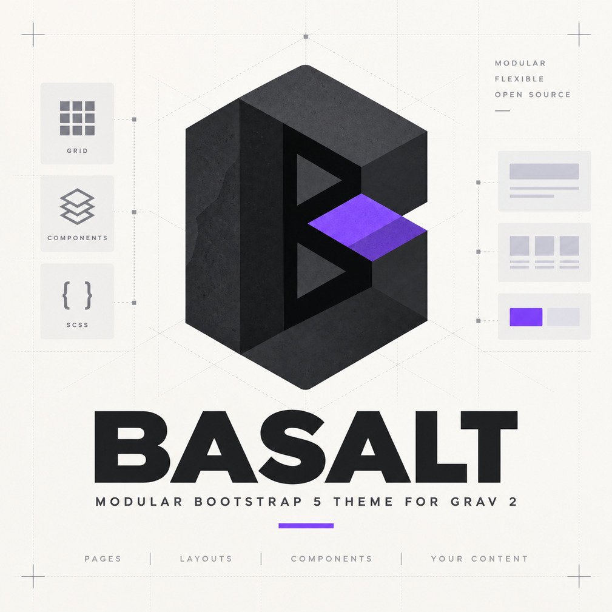

# Basalt



Basalt is a modular Bootstrap 5 parent theme for Grav 2. It provides a minimal
foundation for building project-specific child themes without including the
complete Bootstrap CSS and JavaScript bundles.

> Basalt is currently in early development. Its structure and public API may
> change before version `1.0.0`.

## Features

- Grav 2 and PHP 8.3+ support
- Bootstrap 5.3.8 with selected SCSS and JavaScript modules
- reusable parent-theme API under the stable `@basalt` Twig namespace
- accessible document shell, skip links, breadcrumbs and pagination
- responsive navbar composed from overridable partials
- optional SimpleSearch, LangSwitcher and navbar CTA integrations
- generic collection template with item and card variants
- responsive collection grids with one to four columns
- reusable image and responsive-image renderers using Grav Media
- reusable Card, Accordion, Alert, Modal, Carousel and Tabs components
- Shortcode Core handlers for Accordion, Alert, Modal, Carousel and Tabs
- local Bootstrap Icons and font extension points
- Gulp, Sass and esbuild development and production tasks
- optional manifest-controlled vendor CSS and JavaScript bundles
- deterministic production assets committed in `dist/`
- GitHub Actions build validation

## Requirements

Development requires:

- Grav 2.0+
- PHP 8.3+
- Node.js 22
- npm 10+

Node.js `22.23.2` is defined in `.nvmrc`.

The compiled theme can be used without Node.js or npm.

Optional runtime integrations are installed only when a site needs them:

| Plugin | Purpose |
| --- | --- |
| Breadcrumbs | Breadcrumb navigation and structured data source. |
| Pagination | Pagination data for collection pages. |
| SimpleSearch | Search form and search route used by the navbar. |
| LangSwitcher | Language routing used by the navbar switcher. |
| Shortcode Core | Parsing and registration of Basalt component shortcode handlers. |

None of these plugins is declared as a required dependency in `blueprints.yaml`.
The base theme continues to work when they are absent.

## Installation

Clone the repository into the Grav themes directory:

```bash
cd user/themes
git clone git@github.com:nmorajda/grav-theme-basalt.git basalt
```

Activate the theme in the Grav Admin panel or set it in the Grav configuration:

```yaml
pages:
  theme: basalt
```

## Development

Enter the theme directory and activate the required Node.js version:

```bash
cd user/themes/basalt
nvm install
nvm use
npm ci
```

Start the development watcher:

```bash
npm start
```

Create production assets:

```bash
npm run build
```

Development builds include source maps. Production builds are minified and
written to:

```text
dist/css/style.css
dist/js/script.js
```

The build also writes `dist/basalt-vendor.json`, which records whether optional
vendor CSS and JavaScript bundles exist.

## Optional vendor assets

Basalt provides empty source directories for third-party browser libraries that
need to load before the main theme assets:

```text
src/vendor/css/
src/vendor/js/
```

Place distributed CSS files in `src/vendor/css` and distributed JavaScript
files in `src/vendor/js`. Files are concatenated deterministically in filename
order. Prefix filenames when a library requires a specific order, for example
`10-library.css` and `20-library-addon.css`.

The `vendor` Gulp task generates these optional bundles:

```text
dist/css/basalt-plugins.css
dist/js/basalt-plugins.js
```

It also writes `dist/basalt-vendor.json` with `css` and `js` boolean flags. The
base Twig template reads this manifest and registers only bundles that exist.
With empty vendor directories, the manifest is:

```json
{"css":false,"js":false}
```

Empty directories do not create empty bundles. Rebuilding after removing all
vendor sources removes stale optional bundles. The directories retain their
`.gitkeep` files as extension points.

To add a library:

1. Copy its distributed CSS and JavaScript into the matching `src/vendor`
   directories.
2. Add required initialization to `src/js/script.js`.
3. Run `npm run build` and commit the updated generated files in `dist`.

Vendor CSS loads before `dist/css/style.css`. Vendor JavaScript loads before
`dist/js/script.js`. Both use higher Grav asset priorities than the main theme
assets.

The vendor task removes a leading byte order mark (BOM) from every input before
joining files. This prevents a BOM from appearing at the start or between files
in the generated bundles and keeps them compatible with the Grav CSS and
JavaScript pipelines.

All files in `dist` are generated outputs and must not be edited manually. Use
`npx gulp vendor` to rebuild only the optional bundles and manifest, or
`npm run build` for the complete production build.

## Modular Bootstrap SCSS

Bootstrap components are selected in:

```text
src/scss/_bootstrap-components.scss
```

Only the required imports should remain enabled.

The default configuration includes Bootstrap base styles, containers, grid,
visually hidden helpers and dismissible alert styles without compiling every
Bootstrap component.

Bootstrap variables can be overridden before Bootstrap components are loaded.
Place Basalt and Bootstrap overrides in:

```text
src/scss/settings/_variables.scss
```

Variables intended as extension points should use `!default`.

Custom theme styles are organized under:

```text
src/scss/base/
src/scss/layout/
src/scss/settings/
src/scss/theme/
src/scss/tools/
src/scss/utilities/
```

## Typography and fonts

Basalt uses Bootstrap's system font stack by default. It does not download any
text fonts from external services, so the default configuration requires no
additional network requests.

The actual font depends on the visitor's operating system and may be Segoe UI,
the Apple system font, Roboto, Noto Sans, Liberation Sans or another locally
available sans-serif font.

Basalt exposes two CSS custom properties:

```css
--basalt-font-family-base
--basalt-font-family-headings
```

Their default values are defined in:

```text
src/scss/base/_fonts.scss
```

The base font is also connected to Bootstrap's body font property:

```scss
:root {
    --basalt-font-family-base: var(--bs-font-sans-serif);
    --basalt-font-family-headings: var(--basalt-font-family-base);
    --bs-body-font-family: var(--basalt-font-family-base);
}
```

This allows child themes to change body and heading typography without
recompiling the parent theme.

### Self-hosted fonts

Self-hosted fonts are recommended when consistent typography is required.
They avoid requests to third-party font services and provide greater control
over privacy, caching and availability.

Before including a font, make sure its license permits web embedding and
distribution.

Basalt provides the following source directory for locally hosted fonts:

```text
src/fonts/
```

During the build, Gulp copies `woff` and `woff2` files to:

```text
dist/fonts/
```

Subdirectories are preserved. For example:

```text
src/fonts/inter/InterVariable.woff2
src/fonts/inter/InterVariable-Italic.woff2
```

are copied to:

```text
dist/fonts/inter/InterVariable.woff2
dist/fonts/inter/InterVariable-Italic.woff2
```

A variable font can be registered in SCSS as follows:

```scss
@font-face {
    font-family: "Inter";
    src: url("../fonts/inter/InterVariable.woff2") format("woff2");
    font-style: normal;
    font-weight: 100 900;
    font-display: swap;
}

@font-face {
    font-family: "Inter";
    src: url("../fonts/inter/InterVariable-Italic.woff2") format("woff2");
    font-style: italic;
    font-weight: 100 900;
    font-display: swap;
}

:root {
    --basalt-font-family-base: "Inter", var(--bs-font-sans-serif);
    --basalt-font-family-headings: "Inter", var(--bs-font-sans-serif);
}
```

The font URLs are relative to the generated `dist/css/style.css` file.

For static fonts, create a separate `@font-face` declaration for every required
weight and style:

```scss
@font-face {
    font-family: "Example Sans";
    src: url("../fonts/example-sans/ExampleSans-Regular.woff2") format("woff2");
    font-style: normal;
    font-weight: 400;
    font-display: swap;
}

@font-face {
    font-family: "Example Sans";
    src: url("../fonts/example-sans/ExampleSans-Bold.woff2") format("woff2");
    font-style: normal;
    font-weight: 700;
    font-display: swap;
}
```

WOFF2 is the recommended format for modern browsers. WOFF remains supported by
the build process for projects that require additional legacy compatibility.
TTF, OTF and EOT files are not copied by default.

Only include the weights, styles and character subsets that are actually used.
This reduces the amount of data downloaded by visitors.

After adding or changing fonts, rebuild the production assets:

```bash
npm run build
```

Basalt does not include a text font in the repository. Bootstrap Icons are
handled separately and are copied to `dist/fonts` by the same build process.

### Fonts in child themes

A child theme can override the Basalt typography properties in its own CSS:

```css
:root {
    --basalt-font-family-base: "Example Sans", var(--bs-font-sans-serif);
    --basalt-font-family-headings: "Example Sans", var(--bs-font-sans-serif);
}
```

A child theme that self-hosts fonts should keep them in its own source directory
and copy them to its own `dist/fonts` directory. The Basalt build process only
processes files belonging to Basalt and does not build assets stored in sibling
child themes.

The child stylesheet can then reference its own generated font files:

```css
@font-face {
    font-family: "Example Sans";
    src: url("../fonts/example-sans/ExampleSans-Regular.woff2") format("woff2");
    font-style: normal;
    font-weight: 400;
    font-display: swap;
}
```

### External font services

The parent base template provides an empty `font_stylesheets` block. A child
theme can override it when an external font service is intentionally required:

```twig



    

```

The selected family must also be assigned in the child stylesheet:

```css
:root {
    --basalt-font-family-base: "Inter", var(--bs-font-sans-serif);
    --basalt-font-family-headings: "Inter", var(--bs-font-sans-serif);
}
```

External font services create requests to third-party servers and may require
additional privacy, consent and Content Security Policy considerations.
Self-hosting is therefore the recommended approach for privacy-sensitive
projects.

## Modular Bootstrap JavaScript

The main JavaScript entry file is `src/js/script.js`. It imports
`src/js/modules/bootstrap.js` and applies the `js` class to the document root.

Basalt 0.8.0 bundles these Bootstrap JavaScript modules:

- Alert
- Button
- Carousel
- Collapse
- Dropdown
- Modal
- Offcanvas
- Popover
- ScrollSpy
- Tab
- Toast
- Tooltip

Their corresponding Bootstrap SCSS modules are selected in
`src/scss/_bootstrap-components.scss`. Keep both lists aligned whenever a
component is added or removed. The production bundle is generated by esbuild as
`dist/js/script.js`.

See the [Bootstrap optimization guide](https://getbootstrap.com/docs/5.3/customize/optimize/)
for background on selective imports.

## Navigation and Bootstrap Icons

Basalt builds its primary navigation from visible Grav pages and composes the
navbar from small public partials under
`templates/partials/components/navbar/`. The navigation macro remains in
`templates/macros/navigation.html.twig`.

### Navbar configuration

The shipped defaults are:

```yaml
dropdown:
  enabled: true

icons:
  enabled: true

navbar:
  enabled: true
  expand: lg
  language_switcher:
    enabled: true
  search:
    enabled: true
  cta:
    enabled: true
```

All settings shown above are available in the Admin blueprint and can also be
configured directly in the theme YAML. `navbar.expand` maps to one of the
supported Bootstrap `navbar-expand-*` breakpoints: `sm`, `md`, `lg`, `xl` or
`xxl`.

The navigation contract is:

- a regular item is a link;
- with `dropdown.enabled: true`, a visible parent with visible children is only
  a dropdown button and has no `href`;
- the submenu contains only children and does not add an Overview item;
- the default macro supports one submenu level;
- with dropdowns disabled, the parent is a normal link and children are hidden;
- `icons.enabled` controls page icons configured through frontmatter;
- `navbar.enabled` disables the complete primary navbar.

A page icon uses the Bootstrap Icon name without the `bi-` prefix:

```yaml
---
title: Home
icon: house
---
```

Basalt ships local Bootstrap Icons in `dist/css/icons.css` and `dist/fonts/`.
Decorative icons generated by the navigation macro use `aria-hidden="true"`.
Set `icons.enabled: false` to stop registering the icon stylesheet.

### Optional SimpleSearch

Install the official plugin and disable its stylesheet when the navbar search
form is required:

```bash
bin/gpm install simplesearch
```

```yaml
# user/config/plugins/simplesearch.yaml
enabled: true
built_in_css: false
```

The form is rendered only when both the plugin and
`navbar.search.enabled` are enabled. It respects the plugin `route`,
`min_query_length` and translated validation messages.

### Optional LangSwitcher

Install the official plugin for multilingual routing:

```bash
bin/gpm install langswitcher
```

```yaml
# user/config/plugins/langswitcher.yaml
enabled: true
built_in_css: false
```

The switcher is rendered only when both the plugin and
`navbar.language_switcher.enabled` are enabled. Basalt extends the plugin's
`partials/langswitcher-logic.html.twig` logic and supplies Bootstrap-compatible
list markup.

### Navbar CTA

When `navbar.cta.enabled` is true, Basalt looks for the page
`/_widgets/_navbar/_cta` and renders its content through the generic
`templates/modular/widget.html.twig` template. A minimal source file is:

```text
user/pages/_widgets/_navbar/_cta/widget.md
```

```yaml
---
title: Navbar CTA
visible: false
process:
  markdown: false
---

<a href="/contact" class="btn btn-primary">Contact</a>
```

CTA content is trusted site-authored markup and is rendered with `raw`. Keep the
link text meaningful and preserve visible keyboard focus styles.

## Optional breadcrumbs

Basalt can render breadcrumbs from the official Grav Breadcrumbs plugin without
requiring or installing it automatically. Install the plugin when the site
needs breadcrumb navigation:

```bash
bin/gpm install breadcrumbs
```

Set `built_in_css: false` in the plugin configuration so that the plugin does
not load its own stylesheet. Basalt uses the Bootstrap breadcrumb component
already included in the theme CSS. The plugin must remain enabled for the
component to render.

The integration uses the hierarchy returned by `breadcrumbs.get()` and respects
the plugin's hierarchy, visibility, trailing-link and home-icon settings.
Bootstrap supplies the breadcrumb divider. Breadcrumbs is intentionally not
listed as a Basalt dependency in `blueprints.yaml`, so the theme continues to
work when the plugin is absent.

The public breadcrumb partial keeps its accessible navigation markup separate
from its Schema.org data. It delegates JSON-LD generation to an internal partial
and emits the structured data only when the trail contains at least two items.

## Optional pagination

Basalt provides an accessible Bootstrap component for the official Grav
Pagination plugin without requiring or installing the plugin automatically.
Install it when a page collection needs pagination:

```bash
bin/gpm install pagination
```

Set `built_in_css: false` in the plugin configuration. Basalt already includes
the Bootstrap pagination component, so the plugin stylesheet is not needed.

Pagination belongs to a specific collection and is not rendered globally by
`templates/partials/base.html.twig`. Include the public partial explicitly from
the page template that renders the collection:

```twig



    {# Render each collection item. #}



```

The partial renders only when the plugin is enabled and the pagination helper
contains more than one page. Its default values remain compatible with the
official plugin partial: `page.url` supplies `base_url`, and
`page.collection.params.pagination` supplies `pagination`. Pagination remains
an optional integration and is not listed as a dependency in `blueprints.yaml`.

## Collection template

Use `templates/collection.html.twig` for a Grav collection page. Save the page
as `collection.md` and configure the collection through frontmatter; no Twig in
page content is required:

```yaml
---
title: Articles
content:
  items: '@self.children'
  order:
    by: folder
    dir: asc
  limit: 6
  pagination: true

layout:
  variant: card
  columns: 3

display:
  cover: true
  date: false
  summary: true
  read_more: true
---
```

Supported layout options:

| Parameter | Values | Default | Behavior |
| --- | --- | --- | --- |
| `layout.variant` | `item`, `card` or a safe custom partial name | `item` | Selects `partials/collection/<variant>.html.twig` and falls back to `item`. |
| `layout.columns` | `1`, `2`, `3`, `4` | `1` | Selects responsive Bootstrap row columns. |
| `display.cover` | boolean | `false` | Shows the configured cover or the theme placeholder. |
| `display.date` | boolean | `false` | Shows the date in the `item` variant. |
| `display.summary` | boolean | `true` | Shows the Grav page summary. |
| `display.read_more` | boolean | `false` | Adds the translated read-more link. |
| `cover` | media filename | none | Selects an image from the item's `page.media`. |

Responsive cover `sizes` values match the selected columns:

| Columns | `sizes` |
| --- | --- |
| 1 | `100vw` |
| 2 | `(min-width: 768px) 50vw, 100vw` |
| 3 | `(min-width: 992px) 33.333vw, (min-width: 768px) 50vw, 100vw` |
| 4 | `(min-width: 1200px) 25vw, (min-width: 992px) 33.333vw, (min-width: 768px) 50vw, 100vw` |

The collection uses `partials/elements/responsive-image.html.twig` for Grav
Media covers. It generates derivatives from 320px to 1920px in 320px steps by
default and supplies `srcset`, `sizes`, lazy loading and async decoding. Missing
covers use `images/placeholder.svg`. Empty collections use the Alert component.
Pagination is included automatically but still renders only when the optional
Pagination plugin supplies more than one page.

### Image renderers

`partials/elements/image.html.twig` accepts either a Grav Media `image.object`
or a direct `image.src`. It supports `resize`, `forceResize`, `cropResize` and
`cropZoom` when both `width` and `height` are supplied, plus `classes`, `alt`
and `loading`.

`partials/elements/responsive-image.html.twig` accepts a Grav Media object and
supports `sizes`, `classes`, `alt`, `title`, `loading`, `decoding` and custom
`derivatives.min`, `derivatives.max` and `derivatives.step` values. Use these
Twig partials from templates, not from page content.

## Components and shortcodes

Generic Bootstrap components live under `templates/partials/components/` and
are public extension points for child themes. They are composed with Twig
`include` or `embed` in templates. For example:

```twig

    
        {{ message|e }}
    

```

Content authors can use the matching shortcodes after installing and enabling
Shortcode Core:

```bash
bin/gpm install shortcode-core
```

Shortcodes do not require Twig in Content.

### Accordion

Parameters:

- `accordion`: `id`, `variant` (`default` or `flush`),
  `allow_multiple` and `open_first`;
- `accordion-item`: `title`, `id` and `heading_tag` (`h2`–`h6`).

```text
[accordion id="faq" variant="flush" open_first="true" allow_multiple="false"]
[accordion-item title="First question" heading_tag="h2"]
First answer.
[/accordion-item]
[accordion-item title="Second question" heading_tag="h2"]
Second answer.
[/accordion-item]
[/accordion]
```

### Alert

Parameters: `variant` (default `primary`) and `dismissible`.

```text
[alert variant="warning" dismissible="true"]
Check this message before continuing.
[/alert]
```

### Modal

Parameters: `id`, `title`, `label`, `size` (`sm`, `lg` or `xl`),
`centered` and `scrollable`. Provide either a visible `title` or an accessible
`label`. A trigger is separate from the shortcode:

```html
<button type="button" class="btn btn-primary"
        data-bs-toggle="modal" data-bs-target="#details">
    Open details
</button>

[modal id="details" title="Details" centered="true" scrollable="true"]
Modal content.
[/modal]
```

### Carousel

Parameters:

- `carousel`: `id`, `label`, `controls` and `indicators`;
- `carousel-item`: `image` and `alt`.

The image name resolves through the current page's Grav Media collection.
Provide a concise carousel `label` and meaningful image alternative text.

```text
[carousel id="gallery" label="Project gallery" controls="true" indicators="true"]
[carousel-item image="first.jpg" alt="First project view"]
First caption.
[/carousel-item]
[carousel-item image="second.jpg" alt="Second project view"]
Second caption.
[/carousel-item]
[/carousel]
```

### Tabs

Parameters:

- `tabs`: `id` and a 1-based `active` index;
- `tab`: `title`.

```text
[tabs id="details-tabs" active="1"]
[tab title="Overview"]
Overview content.
[/tab]
[tab title="Specifications"]
Specifications content.
[/tab]
[/tabs]
```

The generated tab buttons and panels include Bootstrap roles, relationships,
selection state and keyboard-focusable panels.


## Theme inheritance

Basalt is intended to be used as a reusable parent theme. Each website can use
a project-specific child theme for its branding, templates and custom assets.

A child theme stream should search the child first and Basalt second:

```yaml
streams:
  schemes:
    theme:
      type: ReadOnlyStream
      prefixes:
        '':
          - user://themes/basalt-child
          - user://themes/basalt

enabled: true
```

The child theme class extends Basalt:

```php
<?php

declare(strict_types=1);

namespace Grav\Theme;

class BasaltChild extends Basalt
{
}
```

The child theme blueprint should declare Basalt as a dependency:

```yaml
dependencies:
  - name: grav
    version: '>=2.0.0'
  - name: basalt
    version: '>=0.8.0'
```

### Extending parent templates

Basalt registers its templates under the `@basalt` Twig namespace. A child base
template can therefore explicitly extend the parent:

```twig

```

### Public Twig API

The following blocks are the stable public Twig API for child themes in Basalt
0.8.0:

| Block | Defined in | Purpose | Call `parent()`? | Override model |
| --- | --- | --- | --- | --- |
| `title` | `templates/partials/base.html.twig` | Renders the complete document title element. | No when replacing the title. | Full replacement. |
| `favicon` | `templates/partials/base.html.twig` | Renders the default PNG favicon and Apple touch icon links. | No when replacing the favicon set. | Full replacement, or extension with `parent()` when retaining the defaults. |
| `head_extra` | `templates/partials/base.html.twig` | Provides an empty extension point at the end of the document head. | Not required; the parent block is empty. | Add child-specific head elements. |
| `font_stylesheets` | `templates/partials/base.html.twig` | Registers font stylesheets before the main theme stylesheet. | Not required; the parent block is empty. | Add font assets. |
| `theme_stylesheet` | `templates/partials/base.html.twig` | Selects and registers one main theme stylesheet. | No; the child selects the replacement stylesheet. | Full replacement of the main stylesheet selection. |
| `stylesheets` | `templates/partials/base.html.twig` | Registers font, main theme and optional icon stylesheets. | Yes, when preserving parent stylesheets. | Add stylesheet registrations around the parent output. |
| `javascripts` | `templates/partials/base.html.twig` | Registers the parent JavaScript bundle in the `bottom` group. | Yes, when preserving parent scripts. | Add script registrations around the parent output. |
| `skip_links` | `templates/partials/base.html.twig` | Renders the required main-content skip link and provides an extension point for additional skip links. | Yes, when adding links; not when providing an equivalent complete collection. | Extend the parent output or replace the collection while preserving a link to `#main-content`. |
| `header` | `templates/partials/base.html.twig` | Renders the document header through the public header partial. | Only when retaining the parent header. | Full replacement of the header region. |
| `main` | `templates/partials/base.html.twig` | Renders the main element, container and page content block. | Only when retaining the parent main region. | Full replacement of the main region. |
| `breadcrumbs` | `templates/partials/base.html.twig` | Conditionally renders the optional Breadcrumbs plugin integration before page content. | Only when retaining the parent breadcrumbs. | Add content around or replace the breadcrumb region. |
| `content` | `templates/partials/base.html.twig`, `templates/default.html.twig`, `templates/error.html.twig`, `templates/collection.html.twig` | Renders content defined by the current page template. | Only when extending that page type's existing content. | Page-type-dependent full replacement. |
| `footer` | `templates/partials/base.html.twig` | Renders the document footer through the public footer partial. | Only when retaining the parent footer. | Full replacement of the footer region. |
| `bottom` | `templates/partials/base.html.twig` | Renders the final `bottom` JavaScript asset group before `</body>`. | Yes. | Add content while preserving final script output. |

The empty `head_extra` block can add child-specific elements such as favicons,
a web app manifest, verification tags or additional metadata. Basalt does not
automatically provide analytics, Google Tag Manager, Open Graph, Twitter Cards
or JSON-LD. Because `head_extra` is rendered at the end of the head, it should
not be treated as the preferred location for performance-critical preloads.

The narrow `theme_stylesheet` block registers `dist/css/style.css` by default.
A child can replace it without `parent()` to select an alternative compiled
stylesheet without duplicating the surrounding asset logic. The optional
`icons.css` remains outside this block and is handled by `stylesheets` in both
cases.

Other blocks, including `head`, `metadata`, `canonical`, `assets`, `body` and
`skip_link`, can technically be overridden. They are implementation details and
are not part of the stable public Twig API for Basalt 0.8.0.

A child can extend the public `skip_links` block and call `parent()` to retain
the default link to `#main-content` while adding links to other landmarks. A
full replacement must still provide an equivalent link to `#main-content`.

A child that replaces the public `main` block must preserve both
`id="main-content"` and `tabindex="-1"` on its main content target. The skip link
depends on this contract to move navigation past the site header.

Basalt sets the document `dir` attribute from Grav's active language metadata.
This improves document semantics for right-to-left languages but does not claim
complete visual RTL support for every component.

The following templates and partials are public override points for child themes:

| Template or partial | Responsibility |
| --- | --- |
| `templates/collection.html.twig` | Renders configurable collection grids, variants, empty state and pagination. |
| `templates/modular/widget.html.twig` | Renders trusted reusable widget page content. |
| `templates/partials/header.html.twig` | Renders the site header and includes the navigation entry point. |
| `templates/partials/navigation.html.twig` | Enables or disables the complete navbar component. |
| `templates/partials/components/navbar/navbar.html.twig` | Composes brand, toggler, menu, search, CTA and language switcher. |
| `templates/partials/components/navbar/brand.html.twig` | Renders `site.title` linked to `home_url`. |
| `templates/partials/components/navbar/toggler.html.twig` | Renders the accessible Collapse trigger. |
| `templates/partials/components/navbar/menu.html.twig` | Calls the public navigation macro for visible pages. |
| `templates/partials/components/navbar/cta.html.twig` | Renders the `/_widgets/_navbar/_cta` page. |
| `templates/partials/components/search/simplesearch.html.twig` | Renders the optional SimpleSearch form. |
| `templates/partials/components/langswitcher/langswitcher.html.twig` | Extends the optional LangSwitcher logic partial. |
| `templates/partials/breadcrumbs.html.twig` | Renders optional Breadcrumbs data and delegates JSON-LD generation internally. |
| `templates/partials/pagination.html.twig` | Renders optional Pagination data for an explicit collection. |
| `templates/partials/collection/item.html.twig` | Renders the default collection item variant. |
| `templates/partials/collection/card.html.twig` | Renders the Bootstrap Card collection variant. |
| `templates/partials/collection/cover.html.twig` | Resolves a media cover or placeholder. |
| `templates/partials/elements/image.html.twig` | Renders a direct URL or transformed Grav Media image. |
| `templates/partials/elements/responsive-image.html.twig` | Renders Grav Media derivatives with `srcset` and `sizes`. |
| `templates/partials/components/card/card.html.twig` | Generic Card with section blocks. |
| `templates/partials/components/accordion/accordion.html.twig` | Generic Accordion wrapper with `accordion_items` block. |
| `templates/partials/components/accordion/item.html.twig` | Generic Accordion item with header and content blocks. |
| `templates/partials/components/alert/alert.html.twig` | Generic Alert with optional dismiss button. |
| `templates/partials/components/modal/modal.html.twig` | Generic Modal with body and footer blocks. |
| `templates/partials/components/carousel/carousel.html.twig` | Generic Carousel wrapper, indicators and controls. |
| `templates/partials/components/carousel/item.html.twig` | Generic responsive Carousel slide. |
| `templates/partials/components/tabs/tabs.html.twig` | Generic Tabs wrapper with navigation and content blocks. |
| `templates/partials/footer.html.twig` | Renders the site footer. |

Child themes can also override the shortcode presentation templates under
`templates/shortcodes/` while retaining the PHP handlers and shortcode names.

The public navigation macro is defined in
`templates/macros/navigation.html.twig` with this signature:

```twig
navigation.render(items, dropdown_enabled, icons_enabled)
```

It renders the supplied items according to the documented navigation contract
and the dropdown and icon switches. The internal `navigation.icon()` helper is
not part of the public API.

Use `parent()` when extending asset blocks:

```twig



    {{ parent() }}

    



    {{ parent() }}

    

```

A template with the same path in the child theme overrides the corresponding
parent template. Templates that are fully overridden do not automatically
receive later changes made to the parent version.

### Child theme assets

The recommended additive asset names are:

```text
dist/css/child.css
dist/js/child.js
```

Basalt registers its assets with priority `100`. Child assets use priority `90`,
so they are rendered afterwards and can override parent styles.

Creating a file in the child theme with the same path as a Basalt asset replaces
the parent asset completely:

```text
dist/css/style.css
dist/js/script.js
```

Use identical paths only when complete replacement is intentional. In normal
child themes, use `child.css` and `child.js`.

The Grav Asset Pipeline can combine the final parent, child and plugin assets.
It does not compile SCSS or bundle JavaScript modules, so it does not replace
the Gulp and esbuild workflow.

For development, keeping the Grav pipelines disabled makes individual assets
and source maps easier to inspect. They can be enabled in production to reduce
the number of requests.

### Bootstrap components in child themes

Basalt owns the Bootstrap installation, Sass configuration and component
selection. Child themes should not compile a second copy of Bootstrap by
default.

CSS custom properties exposed by Bootstrap or Basalt can be overridden in
`child.css`. Sass variables cannot change Bootstrap code that has already been
compiled into the parent `style.css`.

When another generally useful Bootstrap component is required, add its SCSS and
JavaScript imports to Basalt and release a new Basalt version. Project-specific
styles and scripts remain in the child theme.

## Updating Basalt

Updating the parent theme does not overwrite files stored in the child theme.

Changes to parent templates are inherited unless the child theme completely
overrides the same template. After updating Basalt, review overridden templates
for upstream changes and test the child theme against the required Basalt
version declared in its blueprint.

## Project structure

```text
basalt/
├── .github/workflows/ci.yml
├── dist/
│   ├── basalt-vendor.json
│   ├── css/{icons.css,style.css}
│   ├── fonts/
│   └── js/script.js
├── images/
│   ├── apple-touch-icon.png
│   ├── favicon-16x16.png
│   ├── favicon-32x32.png
│   ├── logo.png
│   └── placeholder.svg
├── shortcodes/
│   ├── AccordionShortcode.php
│   ├── AccordionItemShortcode.php
│   ├── AlertShortcode.php
│   ├── CarouselShortcode.php
│   ├── CarouselItemShortcode.php
│   ├── ModalShortcode.php
│   ├── TabsShortcode.php
│   └── TabShortcode.php
├── src/
│   ├── fonts/
│   ├── js/{modules/bootstrap.js,script.js}
│   ├── scss/
│   │   ├── base/
│   │   ├── layout/
│   │   ├── settings/
│   │   ├── theme/
│   │   ├── tools/
│   │   ├── utilities/
│   │   ├── _basalt.scss
│   │   ├── _bootstrap-components.scss
│   │   ├── icons.scss
│   │   └── style.scss
│   └── vendor/{css,js}/
├── templates/
│   ├── collection.html.twig
│   ├── default.html.twig
│   ├── error.html.twig
│   ├── macros/navigation.html.twig
│   ├── modular/widget.html.twig
│   ├── partials/
│   │   ├── collection/
│   │   ├── components/
│   │   │   ├── accordion/
│   │   │   ├── alert/
│   │   │   ├── carousel/
│   │   │   ├── langswitcher/
│   │   │   ├── modal/
│   │   │   ├── navbar/
│   │   │   ├── search/
│   │   │   ├── tabs/
│   │   │   └── card.html.twig
│   │   ├── elements/
│   │   ├── base.html.twig
│   │   ├── breadcrumbs.html.twig
│   │   ├── footer.html.twig
│   │   ├── header.html.twig
│   │   ├── navigation.html.twig
│   │   └── pagination.html.twig
│   └── shortcodes/
├── AGENTS.md
├── basalt.php
├── basalt.yaml
├── blueprints.yaml
├── CHANGELOG.md
├── gulpfile.js
├── languages.yaml
├── package.json
└── README.md
```


## Production assets

The `dist` directory is committed to the repository intentionally. This allows
the theme to be installed and used without running the Node.js build process.

Optional `basalt-plugins.css` and `basalt-plugins.js` files appear in `dist`
only when their source directories contain non-empty matching files. The
`basalt-vendor.json` manifest is always generated.

Source maps are development-only and are excluded from Git.

## License

Basalt is released under the [MIT License](LICENSE).
